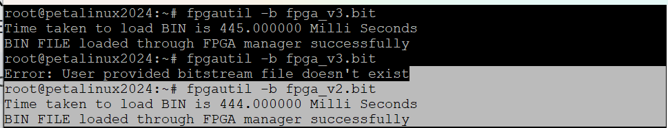
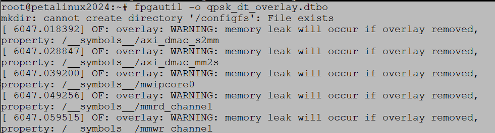
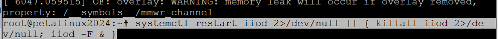
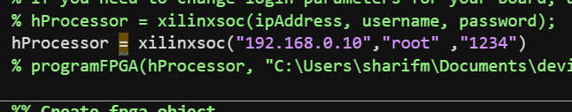
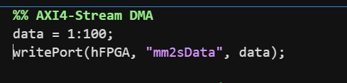
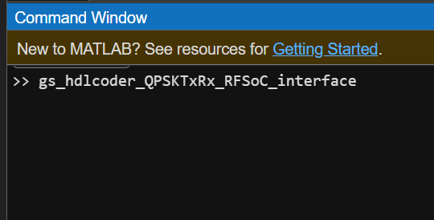

# QPSK on HTG — Tutorial
- linux_files directory contains the petalinux image. Copy all the files inside this directory to Boot partition of the SD card.
- Once the linux is booted, copy the files inside the directory firmware to root partition of SD card i.e. /home/root
- Upload the bitstream

```bash

fpgautil -b fpga_v2.bit

```


- Load the devicetree

```bash

fpgautil -o qpsk_dt_overlay.dtbo

```



- Restart the iiod to make the newly added iio devices visible to external devices.

```bash

systemctl restart iiod 2>/dev/null || { killall iiod 2>/de  v/null; iiod -F & }

```


- Open the Matlab script gs_hdlcoder_QPSKTxRx_RFSoC_interface.m

- Modify following line as per the FPGA

- To send an array modify the following lines in the script

- Now run the script gs_hdlcoder_QPSKTxRx_RFSoC_interface



